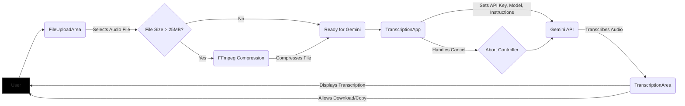

# Audio Transcription with Gemini API

This project provides a client-side audio transcription service using the Gemini API. It includes file upload, compression (if needed), transcription, and download functionalities.

## Tech Stack

- **Next.js:** React framework for building the user interface.
- **Typescript:** Language.
- **Tailwind CSS:** CSS framework for styling.
- **@ffmpeg/ffmpeg:** For audio compression within the browser.
- **@ffmpeg/util:** Provides utility functions for FFmpeg.
- **@google/generative-ai:** Google's Gemini API for transcription.
- **next-themes:** For theme management (light/dark).
- **sonner:** For toast notifications.
- **lucide-react:** Icon library.
- **react-dropzone:** For handling drag-and-drop file uploads.

## Architecture Overview

Here's a simplified overview of the application's architecture:



**Explanation:**

1.  **User:** Interacts with the application through the browser.
2.  **FileUploadArea:** Handles file selection (drag and drop or file chooser), file size checks and validates file duration.
3.  **File Size Check:** Determines if the selected file needs compression.
4.  **FFmpeg Compression:** Compresses the audio file using `@ffmpeg/ffmpeg` in the browser if it exceeds the size limit.
5.  **TranscriptionApp:**
    - Manages the overall transcription process.
    - Handles API key input and storage (localStorage).
    - Uses `GoogleGenerativeAI` to interact with the Gemini API.
    - Passes user instructions
    - Converts audio to base64 for the Gemini API.
    - Handles the streaming response from the Gemini API.
    - Handles cancellation using AbortController
6.  **Gemini API:** Google's Generative AI service.
7.  **TranscriptionArea:** Displays the transcribed text to the user, with options to copy or download.
8.  **Abort Controller:** Mechanism used to cancel in-flight API requests.

## Key Components

- **`FileUploadArea.tsx`:** Handles file uploads, size checks and displays compression prompts.
- **`TranscriptionApp.tsx`:** Main component that orchestrates the transcription process.
- **`TranscriptionArea.tsx`:** Displays the transcribed text and provides download/copy options.
- **`NoSSRWrapper.tsx`:** Used to dynamically import components that rely on browser-specific APIs (like FFmpeg) to prevent server-side rendering errors.

## Getting Started

1.  **Clone the repository:**

    ```bash
    git clone <repository_url>
    cd audio-transcription-gemini
    ```

2.  **Install dependencies:**

    ```bash
    npm install
    # or
    yarn install
    # or
    pnpm install
    ```

3.  **Set up environment variables:**

    - You don't necessarily need an `.env` file for this project as the API key is handled client-side. However, ensure you have a Gemini API key.

4.  **Run the development server:**

    ```bash
    npm run dev
    # or
    yarn dev
    # or
    pnpm dev
    ```

    Open your browser and navigate to `http://localhost:3000`.

## Important Considerations

- **Client-Side Processing:** All audio processing (compression, base64 encoding) happens in the browser. This can be resource-intensive for large files.
- **API Key Security:** The Gemini API key is stored in `localStorage`. While this is convenient for the user, it's not the most secure approach. Consider more robust client-side key management solutions if security is a major concern.
- **Error Handling:** The code includes basic error handling with `toast` notifications. Implement more comprehensive error handling and logging for production environments.
- **FFmpeg Performance:** FFmpeg can be slow for very large files. Consider providing feedback to the user about the expected compression time.
- **Gemini API Limits:** Be aware of the usage limits and pricing of the Gemini API.
- **Cancellation:** Uses `AbortController` to stop the streaming transcription when user cancels. Make sure to handle `AbortError` correctly.
